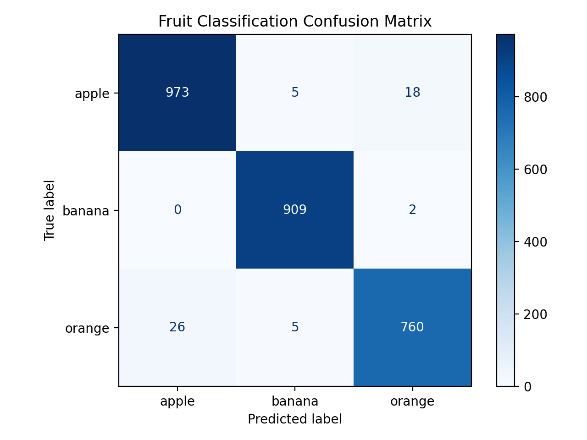
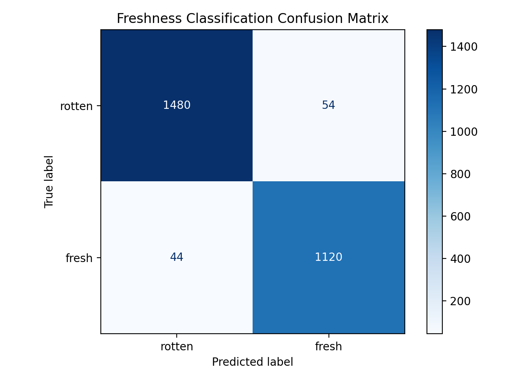
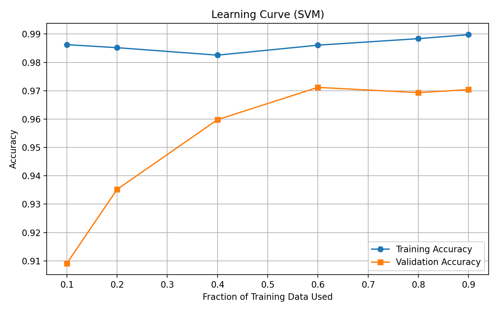

# Fruit Freshness Detection using Classical Computer Vision & SVM

A **classical computer vision + machine learning** project that classifies **fruit type** (`apple`, `banana`, `orange`) and predicts **freshness** (`fresh` / `rotten`) using a **handcrafted feature pipeline** and **Support Vector Machines (SVM)**.

This project intentionally avoids deep learning to emphasize **interpretability**, **data discipline**, and **reproducibility**.

---

## 🔗 Dataset (Kaggle)

**Fruit Freshness Dataset (Apple, Banana, Orange)**
👉 [https://www.kaggle.com/datasets/user2036/fruit-freshness-dataset-v1](https://www.kaggle.com/datasets/user2036/fruit-freshness-dataset-v1)

### Current dataset version: **v2**

* Removed **exact duplicates** (file hash)
* Removed **perceptual duplicates** (pHash)
* Verified **no train–test leakage**
* Cleaned, frozen, and versioned dataset

> All experiments and results in this repository are based strictly on **Kaggle v2**.

---

## Key Highlights

* Fully **CPU-friendly** (no GPU, no CNNs)
* **30-dimensional interpretable handcrafted feature vector**
* Two independent SVM classifiers:

  * **Fruit classifier** → apple / banana / orange
  * **Freshness classifier** → fresh / rotten
* Explicit **dataset sanitation pipeline**
* **Stratified K-Fold cross-validation**
* **Learning curve analysis**
* CLI-based training, evaluation, and prediction

---

## Final Project Structure (Accurate)

```
mini-project/
├── clean_dataset/
│   ├── find_image_duplicates.py
│   ├── keep_best_train_duplicates.py
│   └── move_test_leaks.py
│
├── dataset/
│   ├── train/
│   │   ├── apple/
│   │   ├── banana/
│   │   ├── orange/
│   │   ├── rottenapples/
│   │   ├── rottenbanana/
│   │   └── rottenoranges/
│   ├── test/
│   │   └── (same structure as train)
│   └── dataset-metadata.json
│
├── duplicates/
│   ├── leak_groups/
│   ├── train_groups/
│   ├── post_clean_check/
│   └── duplicate_report.csv
│
├── models/
│   ├── fruit_type_svm.joblib
│   ├── freshness_svm.joblib
│   ├── label_encoder.joblib
│   ├── feature_schema.json
│   ├── confusion_matrix_fruit.png
│   ├── confusion_matrix_freshness.png
│   └── learning_curve.png
│
├── src/
│   ├── extract_features.py
│   ├── train_svm.py
│   ├── evaluate.py
│   ├── cross_validation.py
│   ├── learning_curve.py
│   ├── predict_cli.py
│   ├── save_feature_schema.py
│   └── utils.py
│
├── dataset_snapshot.txt
├── requirements.txt
└── README.md
```

---

## Dataset Freezing & Integrity

* `dataset_snapshot.txt` records the **exact directory structure**
* Duplicate detection performed using:

  * **File hash** → exact duplicates
  * **Perceptual hash (pHash)** → near-duplicates
* Post-clean verification confirms:

  * ✅ No remaining duplicates
  * ✅ No train–test leakage
* Dataset is treated as **read-only** after freezing

---

## Feature Extraction (Frozen Schema)

The system uses a **fixed 30-feature vector**, stored in:

```
models/feature_schema.json
```

### Feature categories

**Color**

* RGB mean & standard deviation
* HSV circular mean & std
* LAB mean & std

**Texture**

* Laplacian variance
* GLCM contrast, energy, homogeneity
* Grayscale entropy

**Shape**

* Area, perimeter
* Circularity, solidity
* Aspect ratio, extent

**Decay**

* Dark pixel ratio

⚠️ Feature order and definitions must not be changed without retraining.

---

## Segmentation Strategy

1. Convert to grayscale
2. Gaussian blur
3. Otsu thresholding
4. Largest contour selected as fruit mask

If segmentation fails, the pipeline **falls back to whole-image statistics** to avoid crashes.

---

## Training

```bash
python src/train_svm.py
```

**Training set size:** 9,453 images

What happens:

* Feature extraction from `dataset/train`
* Label encoding for fruit classes
* GridSearchCV with RBF-kernel SVM
* Best models saved to `models/`

---

## Evaluation

```bash
python src/evaluate.py
```

**Test set size:** 1,879 images

### Fruit classification

* Accuracy: **97.98%**
* Macro F1: **0.98**



### Freshness classification

* Accuracy: **96.17%**
* Macro F1: **0.96**



Confusion matrices are saved to:

```
models/confusion_matrix_fruit.png
models/confusion_matrix_freshness.png
```

---

## Cross-Validation

```bash
python src/cross_validation.py
```

* **Stratified 5-Fold CV** on training data
* Mean accuracy: **97.45%**
* Standard deviation: **0.0036**

This confirms **model stability** and absence of data leakage.

---

## Learning Curve

```bash
python src/learning_curve.py
```

Generates:


**Learning Curve (SVM)**




Observations:

* Validation accuracy plateaus after ~60% data
* Removing ~2,000 duplicates **did not reduce performance**
* Confirms dataset is **information-sufficient**, not overfitted

---

## Prediction (CLI)

```bash
python src/predict_cli.py --image /absolute/path/to/image.jpg
```

Example outputs:

```
Fruit: banana (88.80%)
Freshness score: 68.79% → FRESH
```

```
Fruit: apple (99.88%)
Freshness score: 0.01% → ROTTEN
```

The CLI reports **class probabilities**, not just labels.

---

## Performance Summary (Clean Dataset)

| Task                     | Accuracy |
| ------------------------ | -------- |
| Fruit classification     | ~98%     |
| Freshness classification | ~96%     |

Results remain **stable after duplicate removal**, validating dataset quality.

---

## Known Limitations

* White-background bias in dataset
* Sensitivity to lighting and color casts
* Early decay can be visually subtle
* Classical CV has a bounded ceiling vs deep learning

These are **expected, documented trade-offs**, not bugs.

---

## Why Classical CV + SVM?

This project prioritizes:

* Interpretability over raw accuracy
* Data discipline over brute force
* Reproducibility over black-box models

It is designed as a **strong baseline** and an **educational reference**.

---
